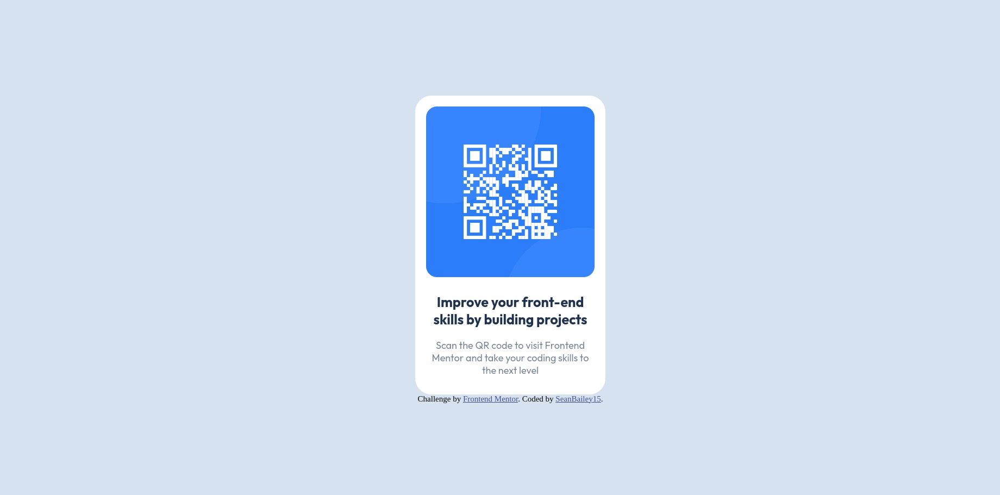

# Frontend Mentor - QR code component solution

This is a solution to the [QR code component challenge on Frontend Mentor](https://www.frontendmentor.io/challenges/qr-code-component-iux_sIO_H). Frontend Mentor challenges help you improve your coding skills by building realistic projects. 

## Table of contents

- [Overview](#overview)
  - [Screenshot](#screenshot)
  - [Links](#links)
- [My process](#my-process)
  - [Built with](#built-with)
  - [What I learned](#what-i-learned)
  - [Continued development](#continued-development)
- [Author](#author)

## Overview

### Screenshot

### Links

- Solution URL: [https://github.com/SeanBailey15/QR_code_component](https://github.com/SeanBailey15/QR_code_component)
- Live Site URL: [https://seanbailey15.github.io/QR_code_component/](https://seanbailey15.github.io/QR_code_component/)

## My process

### Built with

- HTML5 markup
- CSS

### What I learned

I feel like this project helped me learn a little more about using flex in CSS. CSS has been a weak point for me throughout my learning process, as I don't typically have extra time to practice and research.

### Continued development

I would like to continue to get better and more comfortable in all facets of web developement. I am still very early in my learning journey, and can only study and practice when life affords me the opportunities. Bit by bit, challenge by challenge, I hope to become a competent developer.

## Author

- Frontend Mentor - [@SeanBailey15](https://www.frontendmentor.io/profile/SeanBailey15)
